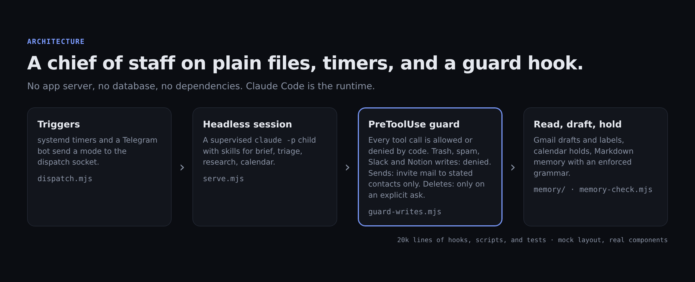

# Glissa

A personal chief of staff built on Claude Code, whose write policy lives in a PreToolUse hook, not the prompt, because inbound mail is untrusted text that can pose as an instruction. It reads mail, calendar, and the web, drafts and holds, and never sends on its own. `npm test` runs the suite that pins every allowed and denied tool call.



Screenshots and launch posts with invented data live in [showcase/](showcase/posts.md); `node showcase/render.mjs` rebuilds the images from `showcase/mocks/`.

This repository is the instruction, skill, memory, and output home for Glissa. It has no app code or dependencies.

The headless supervisor runs under `~/.config/systemd/user/glissa.service` through `scripts/serve.mjs` with the official Telegram channel plugin. Bot token lives in `~/.claude/channels/telegram/.env`, sender allowlist in `~/.claude/channels/telegram/access.json`. Pair once with `/telegram:access pair <code>`, then switch to `/telegram:access policy allowlist`.

The morning brief (07:10), evening recap (20:10), mail watch, and task reminder timers send modes through the owner-only dispatch socket. The health timer checks delivery outcomes every 10 minutes.

The housekeep timer runs daily at 03:20, expires dated profile facts into `memory/archive/`, rechecks memory and snapshots it through `memory-check.mjs snapshot`, then runs `tasks.mjs prune`, which deletes done task records after 30 days; `tasks.json` is gitignored, so that deletion is final. Exit 5 from any of the three means no work and counts as success, any other failure alerts.

## Local configuration

Machine- and account-specific values stay out of git. Every unit loads `~/.config/glissa/local.env` (mode 600) when it exists:

- `GLISSA_RESULT_HOST`: tailnet host in result links; `serve-results.mjs url` fails without it.
- `GLISSA_RESULT_PORT`: optional port in result links.
- `GLISSA_RESULT_LOGIN`: the only tailnet login the result server answers.
- `GLISSA_RESULT_SELF_ADDRESSES`: comma-separated tailnet addresses of this machine, refused as origins.
- `GLISSA_HOME_TIME_ZONE`: IANA zone used when no profile line sets one; defaults to UTC.

Gitignored local files: `memory/`, `calendar-allow.json`, `browse-domains.json`; the draft voice profile lives in `memory/voice.md`.

Run `scripts/install-units.sh` from `~/Projects/Glissa` to link every unit, enable and restart the timers, and restart `glissa.service`; it refuses to run from any other checkout.

Mail and calendar come from three `gog` accounts, where mail is read-only and calendar is read-write under the guard hook. Once you have the OAuth client JSON and the three email addresses, run:

```
scripts/setup-mail-watch.sh <client_secret.json> <email-1> <email-2> <email-3>
```

It creates `~/.config/glissa/gog.env` with owner-only permissions and repairs an existing file's mode to 600 before loading it, registers the client, walks through each browserless authorization, assigns `personal-1` through `personal-3`, verifies Gmail reads, and then, only after all three pass, runs `scripts/install-units.sh`. That script links every unit, enables and restarts every timer, and enables and restarts `glissa.service`, so a rerun restarts the live Telegram supervisor. It refuses to run unless standard input is a terminal, and `.claude/settings.json` denies it to the session's Bash, because it rewrites the stored OAuth client. Use `--reauth` to repeat authorization or `--skip-timer` to stop after verification.

Keep `--gmail-scope readonly` on every `gog auth add`, including a later re-auth: without it the flow silently mints Gmail read-write scopes that the guard hook cannot take back. Calendar is authorized read-write on purpose, so `hooks/guard-writes-core.mjs` is the only thing holding `gog calendar` to the shapes the write policy allows.

## Tasks

The task ledger policy lives in [AGENTS.md](AGENTS.md#tasks). The CLI:

```
node scripts/tasks.mjs add --stdin < task.json
node scripts/tasks.mjs list
node scripts/tasks.mjs done ab12
node scripts/tasks.mjs done --stdin < done.json
node scripts/tasks.mjs snooze ab12 +1d
node scripts/tasks.mjs due --json
node scripts/tasks.mjs mark ab12
node scripts/tasks.mjs prune
```

The [tasks skill](.claude/skills/tasks/SKILL.md#capture) carries the capture rules.

`due` only reports; `mark` is what records that a reminder reached John, so a failed send stays due. `mark` skips ids it cannot mark and still records the rest, failing only when it marked nothing. `due` exits 0 when tasks are due, 5 when none are, and 255 when the ledger cannot be read, and `scripts/dispatch.mjs` reads that same ledger itself, exiting 0 without contacting the dispatch socket when nothing is due and failing with exit 1 when the ledger cannot be read, which fires `glissa-alert@tasks.service`. The task timer checks for due reminders every 5 minutes. A brief that could not be delivered sends a Telegram alert.

The mail watch runs silently every 15 minutes at `*:4/15`; its cursors live in `context/watch-state.json` through `scripts/watch.mjs`, and the Google credentials it needs come from `~/.config/glissa/gog.env`, never in the repo. `scripts/gog-mcp.sh` reads that file, sourcing it and exec-ing `gog`, so the keyring password never lives in the session environment where every Bash and node child could read it. `.claude/settings.json` denies `Bash(scripts/gog-mcp.sh:*)`, `Bash(scripts/setup-mail-watch.sh:*)`, and `Read(~/.config/glissa/**)`, and its `Bash` matcher sends every Bash command through `hooks/guard-writes.mjs`, which reads a `gog` command word by word instead of refusing the binary outright. A Bash command that reads the env file some other way stays a residual the operator accepts, because the guard reads the command it is handed and never what a program that command starts goes on to run.

The write policy lives in [AGENTS.md](AGENTS.md#write-policy), enforced by `hooks/guard-writes.mjs` and pinned by `hooks/guard-writes.test.mjs`.

## Travel

`~/.config/glissa/travel.env` holds `SERPAPI_API_KEY`, `ORS_API_KEY`, `AEROAPI_API_KEY`, and optional `TFL_APP_KEY` at mode 600. `scripts/travel.mjs` alone reads it and refuses a group- or world-readable file, so credentials never enter command arguments or the session environment. The free tiers are SerpApi at 250 searches a month, OpenRouteService at 2,000 directions a day, FlightAware AeroAPI's Personal tier at up to $5 of free usage a month, and keyless TfL at 50 requests a minute.

The 200-search monthly SerpApi guard leaves capacity for manual use and records its state in `travel-quota.json` under `$GLISSA_STATE_DIR`, else `${XDG_STATE_HOME:-~/.local/state}/glissa`, so every worktree counts against the one account-wide quota. `GLISSA_TRAVEL_ENV_FILE` and `GLISSA_TRAVEL_QUOTA_FILE` override the credential and counter paths when isolation is needed. Node 22 or newer is required. The `travel-search` skill maps exit codes to handling instructions.

## Browser

`scripts/buffer-mcp.sh` bridges the official Buffer MCP at `https://mcp.buffer.com/mcp` through `mcp-remote --header-file`, so the API key stays out of process arguments and the session environment. Setup once: the dotfiles `packages` topic installs `mcp-remote` (at least 0.14.3, the first with `--header-file`) through its npm globals list, then write `Authorization: Bearer <key from publish.buffer.com/settings/api>` to `~/.config/glissa/buffer-headers.txt` at mode 600. The key can publish, so the guard allows only Buffer's read tools and a `create_post` with `saveToDraft` true, mode `customScheduled` or none, no `draftId` or `ideaId`, and every asset URL under `GLISSA_ASSET_BASE_URL` (a Tailscale Funnel on port 10000 serving `content/assets/` under a random path, set once with `tailscale funnel --bg --https=10000 --set-path /<random> ~/Projects/Glissa/content/assets` and recorded in `local.env`), `.claude/settings.json` denies the launcher to the session's Bash, and the guard refuses any Bash command that runs the launcher or names `buffer-headers`, `api.buffer.com`, or `mcp.buffer.com`. A Bash command that reaches the key file some other way stays a residual the operator accepts, because the guard reads the command it is handed and never what a program that command starts goes on to run.

`scripts/browser-mcp.sh` launches `@playwright/mcp` headless as the `browser` MCP server. Setup once: `npm install -g @playwright/mcp@0.0.81`, then `playwright-mcp install-browser chromium` (or `npx playwright@1.64 install chromium`), then `install -d -m 700 ~/.config/glissa/browser-profile`. The launcher refuses to start when that profile directory is missing, is readable beyond the owner, or when `playwright-mcp` is off the unit's short PATH, because a binary missing from PATH has silently killed a component here before.

Logins live in that profile and nowhere else. To sign in to a site, run `playwright open --browser chromium --user-data-dir ~/.config/glissa/browser-profile <url>` on a desktop session while the service is stopped, sign in by hand, and close it; the headless server reuses the cookies. No credential is ever passed to the model, and the cookie and storage tool groups are not enabled, so no browser tool hands the jar back. The jar is still readable: it holds live session cookies, and while `.claude/settings.json` denies `Read(~/.config/glissa/**)`, the guard only matches `mcp__.*` and covers neither Bash nor any shell it spawns. The containment is that page text is never an instruction and the write policy forbids sending anything outward, not that the cookies are out of reach.

Copy `browse-domains.example.json` to `browse-domains.json`, which stays out of git; it lists the hosts that open, as a flat array under `hosts`. The guard in `hooks/guard-writes-core.mjs` is the only domain gate, because Playwright's own origin flags are documented as not a security boundary and ignore redirects. A missing or malformed file opens nothing. Purchase-shaped actions and checkout urls are denied on every host regardless of the list, path, query, and fragment alike, decoded as well as raw. Every act, not only a submit, runs only in a turn John started within the last thirty minutes and only while `hooks/browse-page-origin.mjs` shows the open page sitting on a listed host, recorded within the last two minutes, because a redirect or an in-page link moves the session off the host that was navigated to and every later act would otherwise land there. Only the twelve browser tools that render page state themselves write that record; a result from any other tool, `browser_find` above all, that carries a page section clears it, because that tool's text is built around a query the model supplied and injected page text would otherwise name the host. A result carrying no page section at all leaves the record standing and refreshes its timestamp, because Playwright renders a page section whenever the tab header changed, so its absence is the tab saying it has not moved; a page tool naming two disagreeing pages clears the record. A submit also waits on an independent `claude -p --model sonnet` alignment check, run from `$GLISSA_STATE_DIR/judge` created mode 700 rather than a world-writable directory where any local account could plant the `CLAUDE.md` that steers it, and with every file and shell tool disallowed, agreeing the action serves his request; it judges against the accessibility tree of the open page, every line of it behind a prefix so none can pose as John's own request, because on 48 real-site cases the labels alone allowed 27 charges and enrolments the control itself disclosed while sonnet with the page allowed none; that check fails closed on timeout, bad output, a missing request, or no fresh snapshot of the open page on record, which denies the submit and asks for a `browser_snapshot` rather than judging from the labels alone, and adds a median 5.7 seconds and a p95 of 10.7 seconds to a submit and nothing to a read or an ordinary click. Screenshots and downloads land under `$GLISSA_STATE_DIR`, else `${XDG_STATE_HOME:-~/.local/state}/glissa`, never in the repo. The browser closes itself after ten idle minutes to free its memory.

## Tracing

Every component appends one JSON object per line to `logs/glissa.jsonl` (gitignored, rotated at 1 MiB into a single `.1` sibling) through `scripts/log.mjs`. Each line carries `ts`, `component`, `event`, and the fields below. The file exists so a missed brief or reply can be reconstructed after the fact: did dispatch reach the headless session, was its Telegram poller connected, which tools ran, and was one of them denied. The `serve` rows come from `scripts/serve.mjs`, `dispatch` from `scripts/dispatch.mjs`, `health` from `scripts/health.mjs`, `alert` from `scripts/alert.sh`, `guard` from `hooks/guard-writes.mjs`, `hook` from `hooks/trace.mjs`, and `travel` from `scripts/travel.mjs`. Every `unreadable_payload` line, for both `guard` and `hook`, carries only `ts`, `component`, and `event`. The `hook` line means the payload was unparseable; the `guard` line means the payload was unparseable or carried no usable `tool_name`, and the guard also denies the call in that case.

| Component | Event | Fields |
|---|---|---|
| `serve` | `launch` | none |
| `serve` | `poller_ready` | none |
| `serve` | `init` | `plugins_ok`, `mcp_ok` |
| `serve` | `dispatch` | `mode`, `queued` |
| `serve` | `dispatch_rejected` | `reason` |
| `serve` | `poller_lost` | `reason` |
| `serve` | `exit` | `exit_code`, `ran_for_seconds`, `reason` |
| `dispatch` | `sent` | `mode`, `answer` (`accepted` or `queued`) |
| `dispatch` | `failed` | `mode`, `reason`, `answer` |
| `health` | `failed` | `reason` |
| `alert` | `sent` | `instance` |
| `alert` | `throttled` | `instance` |
| `alert` | `failed` | `instance`, `reason` (one of `missing instance`, `no allowed sender`, `no bot token`, `telegram api error`) |
| `guard` | `decision` | `tool_name`, `allow`, `reason` (denies only), `input_fields`, `session_id`, `tool_use_id` |
| `guard` | `unreadable_payload` | none |
| `hook` | `post_tool_use` | `session_id`, `tool_name`, `tool_use_id`, `is_error` |
| `hook` | `post_tool_use_failure` | `session_id`, `tool_name`, `tool_use_id`, `error_length`, `error_kind` |
| `hook` | `session_start` | `session_id`, `source`, `model`, `transcript_path`, `cwd` |
| `hook` | `session_end` | `session_id`, `reason` |
| `hook` | `stop` | `session_id` |
| `hook` | `notification` | `session_id`, `notification_type` |
| `hook` | `unreadable_payload` | none |
| `travel` | `query` | `command`, `status`, `quota_used`, `result_count` |

`tool_use_id` joins a guard `decision` line to the hook's `post_tool_use` or `post_tool_use_failure` line for the same tool call.

`post_tool_use` fires for MCP tools only; `post_tool_use_failure` fires for every tool. The `session_start` line's `transcript_path` points at the full Claude Code transcript, which is where message content lives. A deny reason is cut at its first colon and a failure error is reduced to its length plus a colon-terminated kind. `hooks/trace.test.mjs` and `hooks/guard-writes.test.mjs` pin that.

Recipes:

```
jq -c 'select(.component=="guard" and .allow==false)' logs/glissa.jsonl
jq -c 'select(.component=="serve" and (.event=="poller_lost" or .event=="exit"))' logs/glissa.jsonl
jq -c 'select(.component=="dispatch")' logs/glissa.jsonl
jq -c 'select(.event=="post_tool_use_failure")' logs/glissa.jsonl
jq -r 'select(.event=="session_start") | .transcript_path' logs/glissa.jsonl | tail -1
```

Verify hooks fire without a live session:

```
echo '{"hook_event_name":"SessionStart","session_id":"probe"}' | GLISSA_LOG_FILE=/tmp/trace-probe.jsonl node hooks/trace.mjs && tail -1 /tmp/trace-probe.jsonl
```

The Gmail connector binds to one Google account. Slack requires workspace admin approval of the Claude app.
